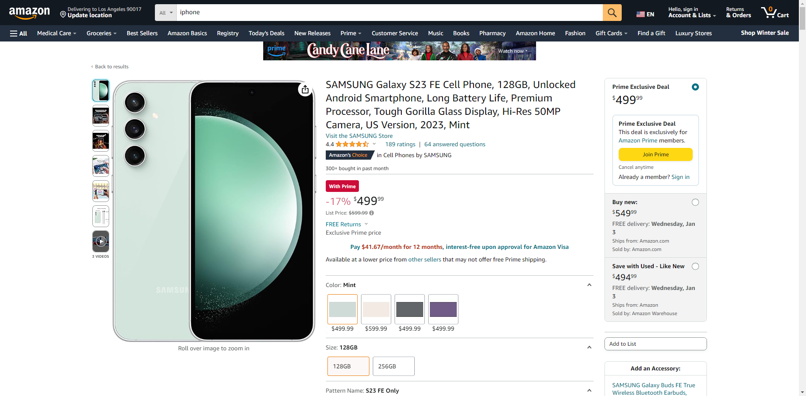

# Amazon 数据采集 API

亚马逊爬虫 API，使你轻松地获取亚马逊产品数据，商品、价格、图片、变体数据等等。

覆盖亚马逊多个站点，提供简单易用的接口，用户只需发送 HTTP 请求即可获取所需数据，无需关心爬虫的实现细节。

1. [案例](#案例)
2. [联系我们](#联系我们)

## 案例



```json
{
  "url": "https://www.amazon.com/SAMSUNG-Unlocked-Android-Smartphone-Processor/dp/B0CD99XXQY/ref=sr_1_1?crid=397C9BUR90FHO&keywords=iphone&psr=EY17&qid=1703872968&s=todays-deals&sprefix=ip%27ho%27e%2Ctodays-deals%2C440&sr=1-1&th=1",
  "country": {
    "full_domain": "www.amazon.com",
    "domain": "amazon.com",
    "code": "US",
    "label": "美国"
  },
  "title": "SAMSUNG Galaxy S23 FE Cell Phone, 128GB, Unlocked Android Smartphone, Long Battery Life, Premium Processor, Tough Gorilla Glass Display, Hi-Res 50MP Camera, US Version, 2023, Mint",
  "price": 499.99,
  "description": [
    "DO MORE w/ EPIC BATTERY POWER: Galaxy S23 FE intuitively manages your usage to conserve energy on its own so you can go all day and into the night without charging¹,²; Share, stream, connect and create with a phone that’s ready for anything",
    "TAKE ON THE BUSIEST DAYS w/ SUPER FAST CHARGING: Galaxy S23 FE keeps your focus on what matters and off the battery bar; With a battery that supports Super Fast Charging³ you can power up quickly and get back to what you love",
    "DO-IT-ALL PROCESSING POWER: Give your livestreaming, video editing and social content creation a boost; With the premium processing power you expect from Samsung Galaxy, you can do more of what you love from the palm of your hand",
    "SMOOTH, DAZZLING, TOUGH DISPLAY: Your content scrolls smoothly and looks amazing, while adaptive Vision Booster automatically adjusts screen brightness based on surrounding light levels; Strong Gorilla Glass helps reduce scratches on your display",
    "CAPTURE SCENES IN STUNNING DETAIL: Create share-worthy content with the high-resolution camera of Galaxy S23 FE; With Super HDR, it’s easy to capture the details that make your shots incredibly lifelike",
    "LOOK SHARP TONIGHT & EVERY NIGHT: Because life happens even in low light; Nightography lets you capture epic pictures, no matter where you are or what time of day; The dark is no longer a dealbreaker",
    "ELEVATE PHOTOS w/ AI-POWERED FEATURES: Like a built-in content curator, Single Take does your creative heavy lifting. Just point and hit record, and you’ll have multiple options and formats to choose from⁴ —photos, slow-motion video clips and more, all ready to share.",
    "EXPERIENCE SEAMLESS CONNECTIVITY: Epic vacation shots? Doodles and drawings? Share them all in a flash between your Galaxy S23 FE and Tab S9 FE — or numerous other devices⁵; Quick Share makes it easy to send to yourself and others",
    "KEEP WHAT YOU WANT, REMOVE WHAT YOU DON’T: Create fantastic photos directly on your phone by harnessing the power of Object Eraser. Simply select and then tap to easily remove objects, people or anything else from your pictures without having to download other apps."
  ],
  "product_detail": [
    {
      "value": "SAMSUNG",
      "key": "Brand"
    },
    {
      "value": "Galaxy S23 FE",
      "key": "Model Name"
    },
    {
      "value": "Unlocked for All Carriers",
      "key": "Wireless Carrier"
    },
    {
      "value": "One UI, Android 13.0",
      "key": "Operating System"
    },
    {
      "value": "5G",
      "key": "Cellular Technology"
    },
    {
      "value": "128 GB",
      "key": "Memory Storage Capacity"
    },
    {
      "value": "Bluetooth, Wi-Fi, USB, NFC",
      "key": "Connectivity Technology"
    },
    {
      "value": "Mint",
      "key": "Color"
    },
    {
      "value": "6.4 Inches",
      "key": "Screen Size"
    },
    {
      "value": "GSM, CDMA",
      "key": "Wireless network technology"
    }
  ],
  "images": [
    "https://m.media-amazon.com/images/I/71JB7R7ttqL._AC_SX679_.jpg",
    "https://m.media-amazon.com/images/I/81vAh8x6XZL._AC_SX679_.jpg",
    "https://m.media-amazon.com/images/I/712YBofr5CL._AC_SX679_.jpg",
    "https://m.media-amazon.com/images/I/91+25w3g3bL._AC_SX679_.jpg",
    "https://m.media-amazon.com/images/I/81SCqYBS8rL._AC_SX679_.jpg",
    "https://m.media-amazon.com/images/I/51+3D4C78gL._AC_SX679_.jpg"
  ],
  "variant_themes": {
    "Color": [
      "Cream",
      "Graphite",
      "Mint",
      "Purple"
    ],
    "Size": [
      "128GB",
      "256GB"
    ]
  },
  "variant": [
    {
      "Color": "Cream",
      "Size": "128GB",
      "is_have_store": true,
      "price": 599.99,
      "images": [
        "https://m.media-amazon.com/images/I/71ukK41npyL._AC_SX679_.jpg",
        "https://m.media-amazon.com/images/I/81vAh8x6XZL._AC_SX679_.jpg",
        "https://m.media-amazon.com/images/I/712YBofr5CL._AC_SX679_.jpg",
        "https://m.media-amazon.com/images/I/91+25w3g3bL._AC_SX679_.jpg",
        "https://m.media-amazon.com/images/I/81SCqYBS8rL._AC_SX679_.jpg",
        "https://m.media-amazon.com/images/I/51Uyij-kH2L._AC_SX679_.jpg"
      ]
    },
    {
      "Color": "Cream",
      "Size": "256GB",
      "is_have_store": true,
      "price": 569.41,
      "images": [
        "https://m.media-amazon.com/images/I/71ukK41npyL._AC_SX679_.jpg",
        "https://m.media-amazon.com/images/I/81vAh8x6XZL._AC_SX679_.jpg",
        "https://m.media-amazon.com/images/I/712YBofr5CL._AC_SX679_.jpg",
        "https://m.media-amazon.com/images/I/91+25w3g3bL._AC_SX679_.jpg",
        "https://m.media-amazon.com/images/I/81SCqYBS8rL._AC_SX679_.jpg",
        "https://m.media-amazon.com/images/I/51Uyij-kH2L._AC_SX679_.jpg"
      ]
    },
    {
      "Color": "Graphite",
      "Size": "128GB",
      "is_have_store": true,
      "price": 499.99,
      "images": [
        "https://m.media-amazon.com/images/I/71iQPXoiWYL._AC_SX679_.jpg",
        "https://m.media-amazon.com/images/I/81vAh8x6XZL._AC_SX679_.jpg",
        "https://m.media-amazon.com/images/I/712YBofr5CL._AC_SX679_.jpg",
        "https://m.media-amazon.com/images/I/91+25w3g3bL._AC_SX679_.jpg",
        "https://m.media-amazon.com/images/I/81SCqYBS8rL._AC_SX679_.jpg",
        "https://m.media-amazon.com/images/I/51i23dYg05L._AC_SX679_.jpg"
      ]
    },
    {
      "Color": "Graphite",
      "Size": "256GB",
      "is_have_store": true,
      "price": 531.99,
      "images": [
        "https://m.media-amazon.com/images/I/71iQPXoiWYL._AC_SX679_.jpg",
        "https://m.media-amazon.com/images/I/81vAh8x6XZL._AC_SX679_.jpg",
        "https://m.media-amazon.com/images/I/712YBofr5CL._AC_SX679_.jpg",
        "https://m.media-amazon.com/images/I/91+25w3g3bL._AC_SX679_.jpg",
        "https://m.media-amazon.com/images/I/81SCqYBS8rL._AC_SX679_.jpg",
        "https://m.media-amazon.com/images/I/51i23dYg05L._AC_SX679_.jpg"
      ]
    },
    {
      "Color": "Mint",
      "Size": "128GB",
      "is_have_store": true,
      "price": 499.99,
      "images": [
        "https://m.media-amazon.com/images/I/71JB7R7ttqL._AC_SX679_.jpg",
        "https://m.media-amazon.com/images/I/81vAh8x6XZL._AC_SX679_.jpg",
        "https://m.media-amazon.com/images/I/712YBofr5CL._AC_SX679_.jpg",
        "https://m.media-amazon.com/images/I/91+25w3g3bL._AC_SX679_.jpg",
        "https://m.media-amazon.com/images/I/81SCqYBS8rL._AC_SX679_.jpg",
        "https://m.media-amazon.com/images/I/51+3D4C78gL._AC_SX679_.jpg"
      ]
    },
    {
      "Color": "Mint",
      "Size": "256GB",
      "is_have_store": true,
      "price": 559.99,
      "images": [
        "https://m.media-amazon.com/images/I/71JB7R7ttqL._AC_SX679_.jpg",
        "https://m.media-amazon.com/images/I/81vAh8x6XZL._AC_SX679_.jpg",
        "https://m.media-amazon.com/images/I/712YBofr5CL._AC_SX679_.jpg",
        "https://m.media-amazon.com/images/I/91+25w3g3bL._AC_SX679_.jpg",
        "https://m.media-amazon.com/images/I/81SCqYBS8rL._AC_SX679_.jpg",
        "https://m.media-amazon.com/images/I/51+3D4C78gL._AC_SX679_.jpg"
      ]
    },
    {
      "Color": "Purple",
      "Size": "128GB",
      "is_have_store": true,
      "price": 499.99,
      "images": [
        "https://m.media-amazon.com/images/I/71xLciLxT6L._AC_SX679_.jpg",
        "https://m.media-amazon.com/images/I/81vAh8x6XZL._AC_SX679_.jpg",
        "https://m.media-amazon.com/images/I/712YBofr5CL._AC_SX679_.jpg",
        "https://m.media-amazon.com/images/I/91+25w3g3bL._AC_SX679_.jpg",
        "https://m.media-amazon.com/images/I/81SCqYBS8rL._AC_SX679_.jpg",
        "https://m.media-amazon.com/images/I/51Pjp8gR3GL._AC_SX679_.jpg"
      ]
    },
    {
      "Color": "Purple",
      "Size": "256GB",
      "is_have_store": true,
      "price": 594.61,
      "images": [
        "https://m.media-amazon.com/images/I/71xLciLxT6L._AC_SX679_.jpg",
        "https://m.media-amazon.com/images/I/81vAh8x6XZL._AC_SX679_.jpg",
        "https://m.media-amazon.com/images/I/712YBofr5CL._AC_SX679_.jpg",
        "https://m.media-amazon.com/images/I/91+25w3g3bL._AC_SX679_.jpg",
        "https://m.media-amazon.com/images/I/81SCqYBS8rL._AC_SX679_.jpg",
        "https://m.media-amazon.com/images/I/51Pjp8gR3GL._AC_SX679_.jpg"
      ]
    }
  ]
}
```
## 联系我们

微信号 : zhouwang99257


